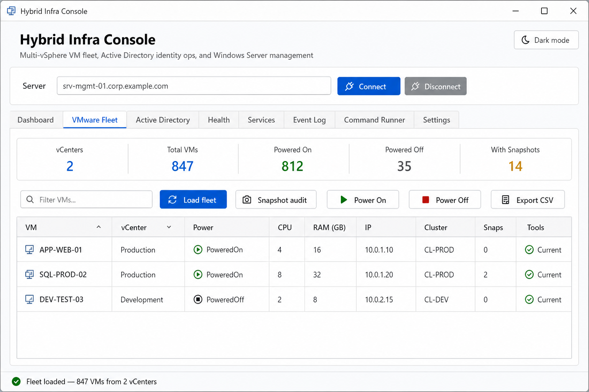
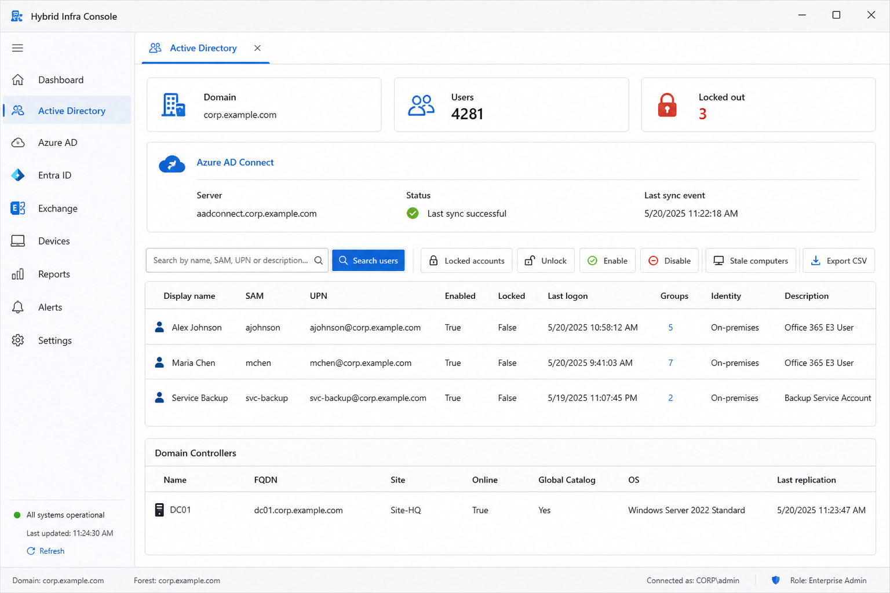
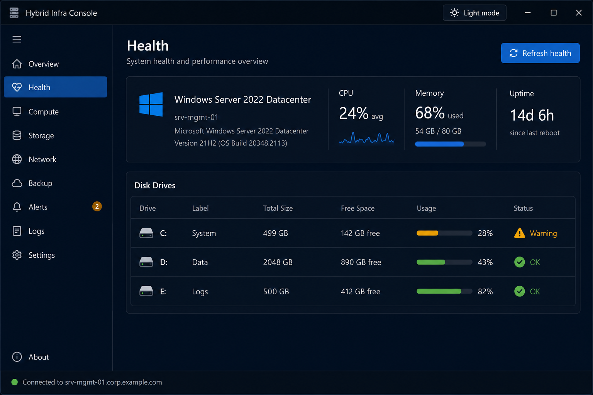
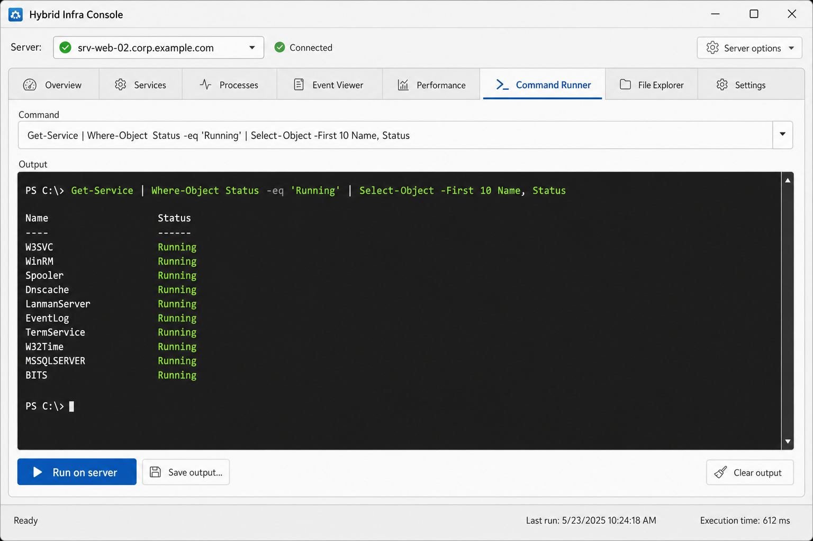

# Hybrid Infra Console

A PowerShell WPF desktop app for infrastructure teams running **multi-vSphere VMware**, **Active Directory / Azure hybrid identity**, and **Windows Server** operations -- all in one window.

Built for ops teams who live in PowerShell and want a fast GUI without standing up a web platform.

## Screenshots

### VMware Fleet

Multi-vCenter inventory, snapshot audit, power controls, and CSV export in one tab.



### Active Directory

User search, locked accounts, Azure AD Connect sync status, stale computer reports, and CSV export.



### Dark mode (Health)

On-call desk theme with remote server health, CPU/memory, and disk capacity at a glance.



### Command Runner

Run PowerShell on connected servers and view output in an embedded console.



## What it does

| Tab | Purpose |
|-----|---------|
| **VMware Fleet** | Multi-vCenter VM inventory, snapshot audit, power on/off, **CSV export** |
| **Active Directory** | User search, locked accounts, unlock/enable/disable, **stale computer report**, **Azure AD Connect sync status**, **CSV export** |
| **Health / Services / Event Log / Command Runner** | Remote Windows Server management via WinRM/CIM |
| **Settings** | vCenter list, Azure AD Connect server, **dark theme** preference |

## Dark theme (on-call desk)

- Click **Dark mode** in the header for instant toggle (saved to config)
- Or enable **Dark theme** on the Settings tab before launch
- Set `"darkTheme": true` in `%APPDATA%\HybridInfraConsole\settings.json`

## CSV export

- **VMware Fleet** tab: load data, then **Export CSV**
- **Active Directory** tab: exports whichever view is active (users, locked accounts, stale computers, or AAD Connect connectors)

## Azure AD Connect sync

1. Set `aadConnectServer` in Settings or config (e.g. `aadconnect.yourdomain.local`)
2. On the **Active Directory** tab, click **Refresh sync**
3. Requires WinRM to the connect server and the ADSync PowerShell module on that host

## Stale computer accounts

- Click **Stale computers** on the Active Directory tab
- Threshold defaults to 90 days (`staleComputerDays` in config)
- Export results to CSV for cleanup tickets

## Requirements

- Windows 10/11 or Windows Server 2016+
- PowerShell 5.1 or PowerShell 7+
- **VMware**: `Install-Module VMware.PowerCLI -Scope CurrentUser`
- **AD**: RSAT Active Directory tools (Windows Optional Features)
- Network access to vCenters, domain controllers, and target servers
- Appropriate permissions (vCenter VM operator, AD account ops, server admin)

## Quick start

1. Copy this folder to a Windows admin workstation (or open from a network share).
2. Install prerequisites:

```powershell
Install-Module VMware.PowerCLI -Scope CurrentUser
# RSAT: Settings > Optional Features > RSAT: Active Directory Domain Services and Lightweight Directory Tools
```

3. Configure vCenters (optional -- you can also add them in the Settings tab):

```powershell
Copy-Item .\config\settings.json.example "$env:APPDATA\HybridInfraConsole\settings.json"
notepad "$env:APPDATA\HybridInfraConsole\settings.json"
```

4. Launch (use one of these -- do **not** double-click `.psm1` files):

```powershell
cd "C:\path\to\ServerOpsToolkit"
.\Launch-ServerOpsToolkit.ps1
```

Or double-click **`Launch-ServerOpsToolkit.bat`** in Explorer.

5. **Settings** tab -> Connect all vCenters -> **VMware Fleet** -> Load fleet
6. **Active Directory** tab -> Refresh domain -> Search users or view locked accounts

## Sapien PowerShell Studio

This project is structured for PowerShell Studio:

- Open `ui\MainWindow.xaml` in the designer for layout changes
- Put business logic in `src\*.psm1` modules (not in the launcher)
- Wire events in `Launch-ServerOpsToolkit.ps1`

Import the folder as a project and set `Launch-ServerOpsToolkit.ps1` as the startup script.

## Project layout

```
ServerOpsToolkit/
├── Launch-ServerOpsToolkit.ps1   # Entry point
├── media/                       # README screenshots
├── ui/MainWindow.xaml           # WPF layout
├── config/settings.json.example # Sample multi-vCenter config
├── Tools/                       # Standalone infra tools (see Tools/README.md)
├── src/
│   ├── ConfigStore.psm1         # Settings persistence
│   ├── VsphereOps.psm1          # Multi-vCenter VMware ops
│   ├── ActiveDirectoryOps.psm1  # AD / hybrid identity ops
│   ├── ServerOpsToolkit.psm1    # WinRM server ops
│   └── Theme.ps1
└── README.md
```

## Security notes

- vCenter credentials are prompted once per session (not stored in the app).
- AD unlock/disable actions require appropriate delegated permissions.
- Command Runner executes arbitrary PowerShell on remote servers -- restrict access
- For production, sign scripts and use constrained execution policy.

